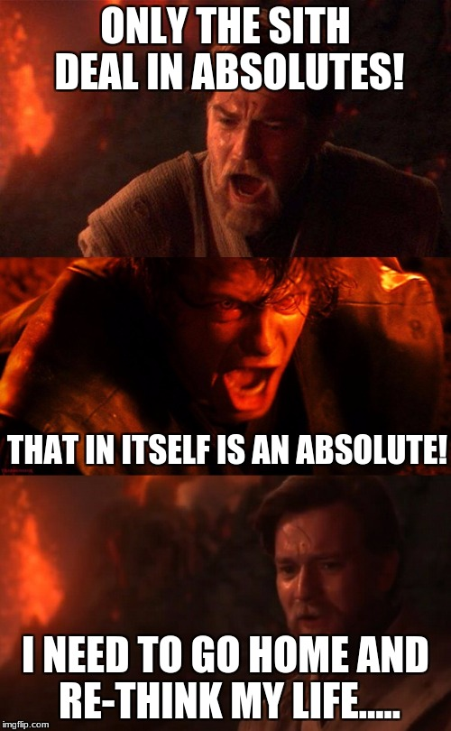

# Human Centered Design

Student: Tristan Brattinga
Studentnr: 500881296
Docent(en): Vasilis van Gemert & Marie van Driessche

## 📝 Opdrachtomschrijving

Bij het vak Human Centered Design ga ik aan de slag met het ontwerpen van een web toepassing voor een persoon met
een beperking. Het web is een geweldige plek, alleen zijn er talloze tekortkomingen voor mensen die niet dezelfde
capaciteiten hebben als de gemiddelde mens zonder beperkingen. Het is aan de frontiers van het web, mijn peers en ik,
om het web voor iedereen toegankelijk te maken. Bij deze opdracht ga ik hands-on aan de slag met een persoon met een 
beperking om te kijken waar pijn punten liggen bij deze persoon, waar ik en anderen niet bij stilstaan. Bij deze 
opdracht komen de volgende 4 Exclusive Design Principles aan bod: 

1. Study situation
2. Ignore conventions
3. Prioritise identity
4. Add nonsense

Er zijn in totaal drie personen met alle drie een verschillende beperking:

1. Darice (Mijn testpersoon), is op latere leeftijd doof geworden. Ze heeft een typ-tolk en een speak-easy apparaat.
2. Eric, zit in een elektrische rolstoel. Zijn handen staan anders.
3. Roger, heeft maculadegeneratie. Hij kan steeds slechter zien en is nu op het punt dat hij echt niet meer zonder
   screen reader kan.

Iedere week van de vier weken is er op woensdag het testmoment met jouw aangewezen testpersoon.

### 🧏 Darice 

Ik ben onderverdeeld bij de testpersoon Darice. Zij heeft te maken met doofheid op latere leeftijd. Dit betekent dat 
zijn vroeger wel degelijk geluiden heeft meegekregen en zich hierdoor bepaalde geluiden nog wel voor kan stellen. 
Voor mijn opdracht en uitvoering kan dit heel goed van pas komen. Dit betekent dat ik geluidseffecten moet 
accentueren en niet volledig visueel hoef uit te leggen. Voor Darice zijn er twee mogelijke opdrachten om uit te kiezen:

1. Darice wil graag de inhoud van podcasts kunnen volgen, inclusief alle hoorbare details zoals sfeergeluiden,
   geluidseffecten, en nuances zoals intonatie en andere eigenschappen van de stemmen. Is de persoon bijvoorbeeld boos?
   Verdrietig? Vrolijk?
2. Ze wil films kunnen volgen, ook de hoorbare details zoals geluidseffecten, (spannende) muziek, etc.

## 🔍 Week 1: Project Verkenning

Voor de aanvang van week 1 van het vak HCD ben ik ernstig ziek geworden, waardoor ik de hele week niet bij de
lessen op school aanwezig kon zijn. Ik heb mij in de eerste week ingelezen in de opdracht en gekeken naar wat de
vereisten zijn voor het succesvol voltooien van dit vak. Ik heb gekozen voor de film opdracht. Ik hou niet van podcasts 
en vond het moeilijk om hier een concept om heen te bedenken. Doordat ik niet bij de lessen aanwezig kon zijn, wist ik 
niet dat er bepaalde films waren die Darice heel leuk vindt en we daaruit konden kiezen als inspiratie. Ik heb dus zelf 
een film uitgekozen naar mijn eigen voorkeur.

### 💡 Mijn Idee

Ik heb gekozen voor een film uit mijn jeugd waar er een mooi verhouding is tussen dialoog en visuals. De film die ik heb
gekozen is **Star Wars: Revenge of the Sith**. Ik heb voor deze film en specifiek het fragment, Duel on Mustafar, 
gekozen, omdat dit een fragment is met heel veel emotionele lading en veel actie. Ik kreeg het idee om een Star-Wars 
themed player te maken die het gevoel en de sfeer van de film versterkt. Het lijkt mij ook tof om een volledig 
aanpasbare ervaring te maken voor mensen met verschillende beperkingen, met als primaire focus doven. Zo kan iedereen 
naar deze film kijken met mijn video player.

<caption>Bron: <a href="https://imgflip.com/i/1zzgz9">Image tagged in sith,obi-wan,anakin,mustafar,absolutes. (z.d.). Imgflip. https://imgflip.com/i/1zzgz9</a></caption>

## 👣 Week 2: Eerste Stappen

In week 2 was ik gelukkig weer in staat om bij de lessen aanwezig te zijn. Aangezien wij woensdag en donderdag het vak 
HCD krijgen en er iedere week op woensdag wordt getest, begon ik gelijk op deze woensdag met mijn eerste test. Ik had 
nog niks in code staan, omdat ik ziek ben geweest en graag eerst wilde kijken wat Darice van mijn film keuze vindt 
en het fragment. Ook wilde ik een idee vormen over de belangrijkste aandachtspunten binnen mijn film fragment.

### 💬 Feedback van Darice

- Darice kent het 'iconische' geluid van de lightsabers, omdat zij vroeger wel gehoor had en Star Wars toen wel 
  heeft gezien. Ik moet dit geluid goed proberen te visualiseren, omdat voor een doof-geboren persoon dit niet 
  'iconisch' is, omdat hij/zij het nog nooit heeft gehoord.
- De speling tussen goed en kwaad geeft veel mogelijkheden voor visuele toevoegingen en vertalingen. Denk aan de 
  kleuren blauw (goed) en rood (kwaad).
- 

### 📈 Voortgangsgesprek Vasilis

### 🧠 Conclusie

## 🤖 Week 3: Werkend Prototype

### 💬 Feedback van Darice

- Mijn videospeler ziet er heel goed en verzorgd uit. Ze vond de layout heel mooi.
- Darice zou graag een functionaliteit zien waarbij ze zelf de kleuren van de ondertiteling kan aanpassen. Gekleurde 
  ondertitelingen kunnen een contrast-probleem veroorzaken en dit is niet toegankelijk.
- Zij dacht dat het 'choke' effect een onderdeel van de film was. Hier was een klein misverstand over het feit dat 
  ik dit zelf heb toegevoegd. Dit geeft aan dat ik het duidelijker en visueler moet maken, dat dit een eigen 
  toevoeging is.
- Het 'alarm' effect is heel goed gedaan zegt ze. Het duurt niet te lang en geeft goed weer dat er een hard en 
  alarmerend geluid afgaat.
- Darice begreep de timestamps voor de visuele effecten niet helemaal, omdat ze graag gewoon de film wil kijken. Ik 
  heb haar uitgelegd dat het voor de film niet van toegevoegde waarde is, maar dat ik het heb geïntegreerd om het 
  navigeren naar de visuele effecten makkelijker te maken en deze ook wat meer te showcasen.

### 📈 Voortgangsgesprek Vasilis

Op vrijdag heb ik mijn tweede voortgangsgesprek met Vasilis gehad. Dit ging heel goed en hij was zeer te spreken 
over mijn product. 

Een aantal key punten uit het gesprek:
- Heel goed dat ik verschillende lettertypes heb gebruikt voor ieder personage. Dit geeft meer vorm aan de toon 

### 🧠 Conclusie

Na het verkrijgen van de feedback van Darice 

## 🏁 Week 4: Afronden en Fine-tunen

### 💬 Feedback van Marie

Deze week was Darice niet aanwezig, maar Marie van Driessche. Marie is een lerares die les geeft bij CMD. Ze is haar 
hele leven al doof. Zij is bij alle testrondes en lessen aanwezig geweest en vervult deze week de rol van Darice als 
testpersoon. Zij heeft mij de volgende punten van feedback gegeven:

- Marie was te spreken over mijn algehele vormgeving.
- Zij vond de implementatie voor kleuren manipulatie van de ondertitelingen een leuke toevoeging. Wel zei ze hierbij 
  dat ik moet uitkijken dat de gebruiker niet te veel moet aanpassen en instellen voordat de film gestart kan worden. 
  De gebruiker wil graag makkelijk een film kunnen kijken zonder eindeloze instellingen aan te moeten passen. 
- De player en alles daar omheen zijn heel uitgebreid, ze heeft alleen het idee dat er visuele toevoegingen missen 
  binnen mijn fragment. Ik moet dit meer uitwerken.

### 🧠 Conclusie

### ⚙️ Verdere Ontwikkelingen

Als ik meer tijd zou hebben voor dit project zou ik de volgende functionaliteiten en aanpassingen doorvoeren:
1. Een indicator die tijdens het gevecht aangeeft wie er de overhand heeft met aan de ene kant een rode kleur en een 
   blauwe aan de andere kant. Ik zou dit zien als een 'win-meter', ofwel wie de overhand heeft als een soort 
   touwtje-trek gimmick. Dit zou ook bijdragen aan het principe: _Add nonsense_.
2. 

## 📚 Bronnen

- Karsen Jackson. (2023, January 31). Star Wars Revenge of the Sith  Anakin vs Obi Wan  4K HDR + AI 60fps [Video]. YouTube. https://www.youtube.com/watch?v=JV8InNhMdkA
- HTML: HyperText Markup Language | MDN. (2025, 10 april). MDN Web Docs. https://developer.mozilla.org/en-US/docs/Web/HTML/Reference/Elements/input/color
- @supports - CSS: Cascading Style Sheets | MDN. (2025, 5 maart). MDN Web Docs. https://developer.mozilla.org/en-US/docs/Web/CSS/@supports
- Cmda-Minor-Web. (z.d.). GitHub - cmda-minor-web/web-typography-22-23: 🎓 Web Typography · 2022-2023 · Curriculum and Syllabus. GitHub. https://github.com/cmda-minor-web/web-typography-22-23
- Star Jedi Font | Dafont.com. (z.d.). https://www.dafont.com/star-jedi.font
- Browse Fonts - Google Fonts. (z.d.). Google Fonts. https://fonts.google.com/
- SVG Wars: May the morph be with you. (GSAP3). (z.d.). CodePen. https://codepen.io/PointC/pen/mmMXQK
- cobalt. (z.d.). Cobalt. https://cobalt.tools/
